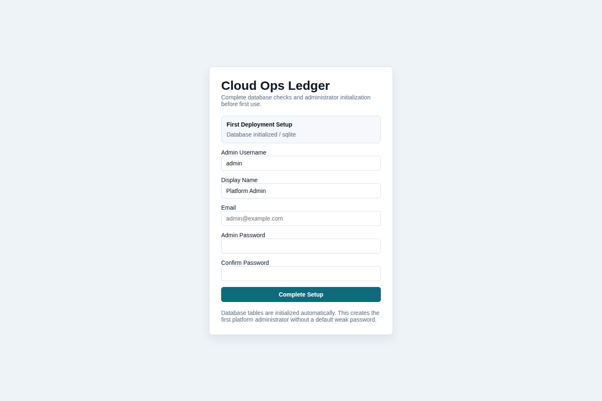
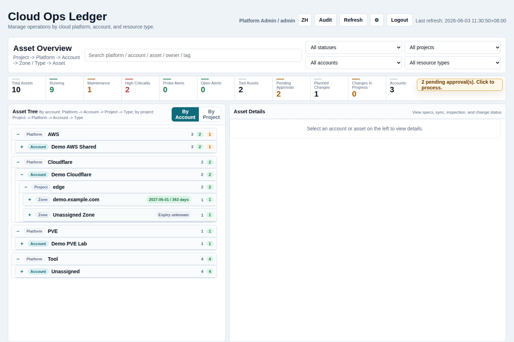
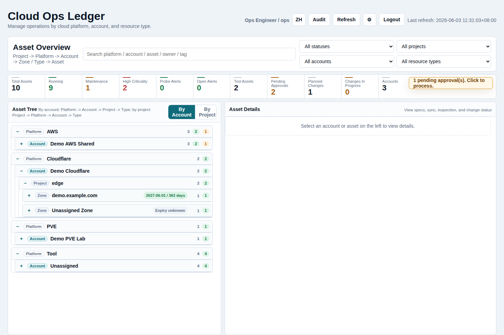
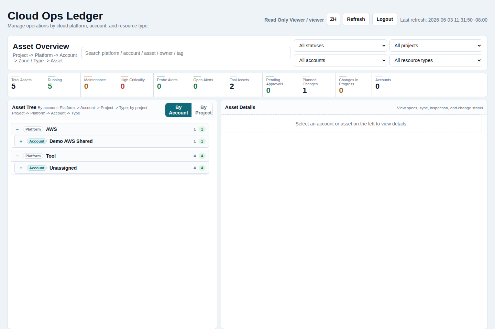
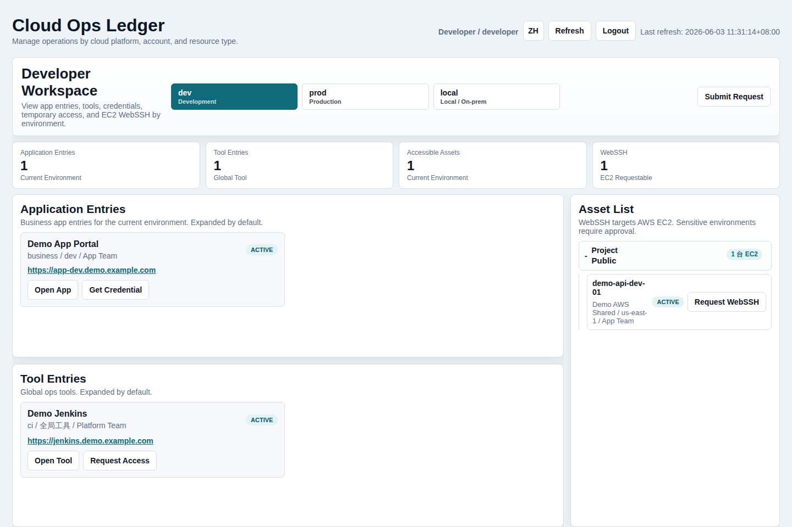
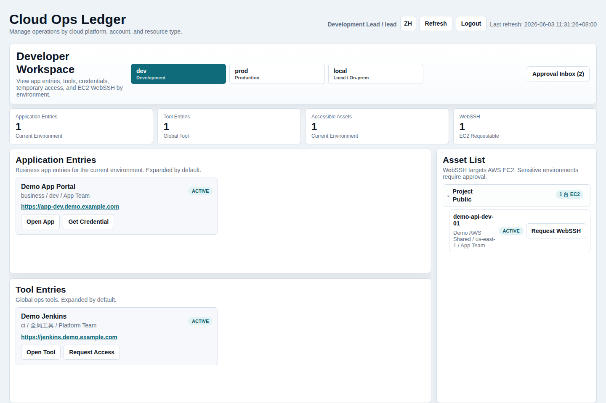
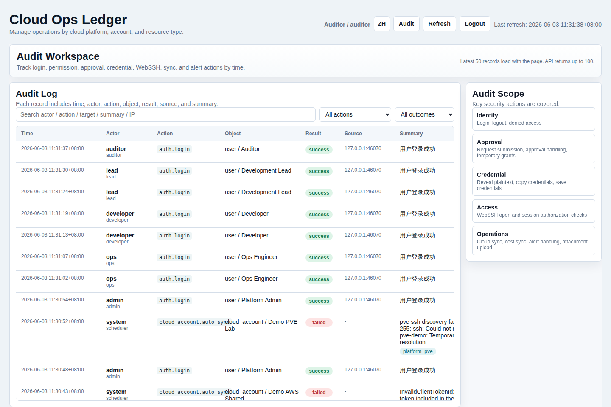

# OpsLedger

Self-hosted cloud operations ledger, lightweight CMDB, cloud asset inventory, credential approval, audit log, cost snapshot, and WebSSH gateway for SRE, DevOps, platform engineering, and small cloud operations teams.

[中文文档](./README.zh-CN.md)

OpsLedger is a lightweight cloud operations ledger for small platform and SRE teams. It tracks cloud accounts, assets, credentials, approvals, audit events, probes, cost snapshots, and controlled WebSSH access in a single Go service.

## Search Keywords

OpsLedger can be found by searches such as **cloud operations ledger**, **cloud asset inventory**, **open source CMDB**, **self-hosted CMDB**, **DevOps asset management**, **SRE operations platform**, **cloud account management**, **credential approval workflow**, **WebSSH gateway**, **AWS asset discovery**, **Cloudflare DNS inventory**, **PVE VM inventory**, **infrastructure audit log**, **cloud cost snapshot**, and **internal developer portal**.

中文搜索关键词：**云平台运维台账**、**云资产管理**、**开源 CMDB**、**自托管 CMDB**、**运维资产台账**、**云账号管理**、**凭证审批**、**权限审批流**、**WebSSH 堡垒机**、**AWS 资产发现**、**Cloudflare DNS 管理**、**PVE 虚拟机台账**、**运维审计日志**、**云成本快照**、**开发者工作台**。

## Product Capabilities

- **Operations asset ledger**: manage platforms, cloud accounts, projects, environments, resource types, asset specs, ownership, status, criticality, tags, inspections, changes, and sync history in one workspace.
- **Cloud discovery**: discover AWS assets and Cost Explorer snapshots, Cloudflare zones and DNS/edge resources, and PVE hosts/VMs through read-only SSH commands. Aliyun, Tencent Cloud, and manual assets are reserved in the platform model.
- **Developer self-service**: developers see application entries, global tools, accessible assets, temporary credentials, and EC2 WebSSH request actions by environment.
- **Approval and temporary access**: route credential and WebSSH requests through configurable approval flows; approved requests create time-limited grants rather than long-lived shared access.
- **Credential governance**: store cloud account keys, tool passwords, API tokens, SSH keys, and generic secrets with encryption and masked UI display.
- **Audit and security trail**: record login, denied access, approval, credential reveal/copy, WebSSH, sync, alert, and attachment activity with time, actor, object, result, source, and summary.
- **Cost and chargeback foundation**: keep AWS account cost snapshots and provide a project chargeback view as a starting point for Cost Allocation Tag or CUR integration.
- **Deployment options**: run as a single Go binary with embedded UI, use SQLite by default, or switch to PostgreSQL/MySQL; deploy with Docker Compose or systemd.

## Role Workspaces

| Role | Default workspace | Typical work |
| --- | --- | --- |
| Platform Admin | Operations workspace | Configure platforms, accounts, users, roles, permissions, approval flows, tags, sync jobs, and security settings. |
| Ops Engineer | Operations workspace | Maintain assets, sync cloud accounts, review inspections and alerts, process approvals, and manage credentials. |
| Developer | Developer workspace | Open app entries and tools, view scoped assets, request credentials, and request or use approved WebSSH access. |
| Development Lead | Developer workspace | Work as a developer and approve team requests for development and test environments. |
| Auditor | Audit workspace | Review time-ordered audit events, denied access, credential access, approval actions, WebSSH sessions, sync activity, and alert handling. |
| Viewer | Read-only operations workspace | Review asset status, account posture, costs, inspections, and changes without configuration permissions. |

## Feature Matrix

| Area | What OpsLedger provides |
| --- | --- |
| Asset model | Platform -> account -> project/environment/resource type -> asset, with tags, specs, status, owner, and criticality. |
| Cloud accounts | Credential storage, manual sync, scheduled sync, sync history, account-level detail cards, and cost snapshots. |
| AWS | EC2, EBS, EIP, ELB, S3, RDS, VPC, subnet, security group discovery, tag import, stale marking, and Cost Explorer snapshots. |
| Cloudflare | Zone, DNS record, Worker, R2, WAF ruleset, and load balancer discovery, plus domain expiry and DNS probe tracking. |
| PVE | Read-only discovery for hosts, VMs, LXC, storage, networks, snapshots, backup jobs, clusters, and pools. |
| Tools and apps | Global tools and environment-specific application entries, with optional credential governance. |
| Approvals | Configurable approval flows for credentials and WebSSH, step-level approver roles, and temporary grants after approval. |
| WebSSH | Browser SSH session for approved EC2 access, backed by short-lived authorization and audit records. |
| Inspections and alerts | Automatic probe records, inspection records, alert records, attachments, handling status, and asset-level history. |
| Security | HttpOnly sessions, CSRF protection, RBAC, data scoping, encrypted credentials, audit trail, and optional strict SSH host key checks. |
| Deployment | First-run setup wizard, SQLite default, PostgreSQL/MySQL support, Docker Compose, and systemd install script. |

## Screenshots

### First Deployment



### Operations Workspaces

Admin and Ops roles use the cloud operations workspace for asset trees, account views, inspections, changes, approvals, and sync posture.





Viewer has a read-only operations view for status review without configuration access.



### Developer Workspaces

Developer and Development Lead roles use the environment-first workspace for app entries, global tools, credential requests, and WebSSH access requests.





### Audit Workspace

Auditor uses a dedicated audit page focused on security and operation events.



## Quick Start

Run with a local SQLite database:

```bash
go run ./cmd/opsledger
```

Open `http://127.0.0.1:18090/`.

On first deployment, OpsLedger initializes the database schema automatically. If no user exists, the login page switches to the setup wizard and asks you to create the first platform administrator. No default weak password is created.

## Container Deployment

```bash
cp deploy/opsledger.env.example .env
docker compose up -d --build
```

The service listens on `http://localhost:18090/` and stores SQLite data in the `opsledger-data` Docker volume.

## Binary Deployment

Use a release package when you want to copy OpsLedger to a Linux or Windows server without installing Go:

```bash
./scripts/build-release.sh v0.1.0
ls -lh releases/
```

Linux package:

```bash
tar -xzf releases/opsledger-v0.1.0-linux-amd64.tar.gz
cd opsledger-v0.1.0-linux-amd64
./start.sh
```

Windows package:

```powershell
Expand-Archive .\releases\opsledger-v0.1.0-windows-amd64.zip
cd .\opsledger-v0.1.0-windows-amd64
.\start.ps1
```

For a managed Linux service with systemd on a host with Go installed:

```bash
sudo ./scripts/install-systemd.sh
sudo systemctl status opsledger --no-pager
```

The installer builds `./cmd/opsledger`, installs it under `/opt/opsledger`, creates `/var/lib/opsledger`, writes `/etc/opsledger/opsledger.env` if missing, and enables the `opsledger` systemd service.

## Important Environment Variables

| Variable | Default | Description |
| --- | --- | --- |
| `OPSLEDGER_ADDR` | `127.0.0.1:18090` | HTTP listen address. Use `0.0.0.0:18090` in containers. |
| `OPSLEDGER_DATA` | `data/opsledger.db` | SQLite database path. |
| `OPSLEDGER_DB_DRIVER` | `sqlite3` | `sqlite3`, `postgres`, or `mysql`. |
| `OPSLEDGER_DB_DSN` | empty | DSN for the selected database driver. |
| `OPSLEDGER_CREDENTIAL_KEY` | derived dev key | 32-byte base64 or plain key for credential encryption. Set this in production. |
| `OPSLEDGER_COOKIE_SECURE` | `false` | Set to `true` behind HTTPS. |
| `OPSLEDGER_DEV_SEED_USERS` | `false` | Creates local test users only when enabled. |
| `OPSLEDGER_DEV_SEED_PASSWORD` | empty | Password used by dev seed users. |
| `OPSLEDGER_SEED_EXAMPLE_TOOLS` | `false` | Optionally creates example tool entries. |
| `OPSLEDGER_SSH_STRICT_HOST_KEY` | `false` | Enforce SSH host key checking for WebSSH. |
| `OPSLEDGER_SSH_KNOWN_HOSTS` | empty | known_hosts file for WebSSH. |
| `OPSLEDGER_PVE_SSH_STRICT_HOST_KEY` | `false` | Enforce SSH host key checking for PVE discovery. |
| `OPSLEDGER_PVE_SSH_KNOWN_HOSTS` | empty | known_hosts file for PVE discovery. |

## Repository Layout

```text
cmd/opsledger/          Service entrypoint
internal/app/           HTTP API, embedded UI, auth, approvals, WebSSH
internal/discovery/     AWS, Cloudflare, PVE discovery
internal/model/         Data models
internal/store/         Storage, migrations, seed data, RBAC, audit, credentials
deploy/                 systemd and env examples
scripts/                install and operations scripts
docs/                   Public documentation
data/.gitkeep           Placeholder only; runtime DB files are ignored
```

## Security Notes

- Do not commit runtime databases, `.env` files, backups, private keys, or cloud credentials.
- Set `OPSLEDGER_CREDENTIAL_KEY` before storing real credentials.
- Use HTTPS and set `OPSLEDGER_COOKIE_SECURE=true` in production.
- Use strict SSH host key verification for production WebSSH/PVE usage.
- Development seed users must be disabled for public or production deployments.

See [SECURITY.md](./SECURITY.md) and [docs/deployment.md](./docs/deployment.md).

## License

MIT
