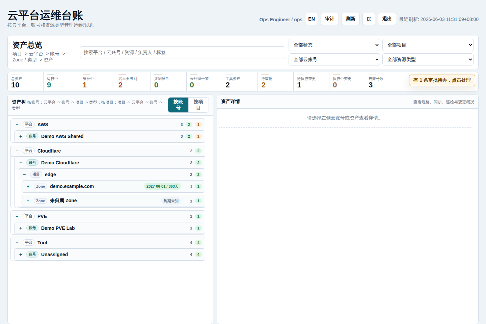
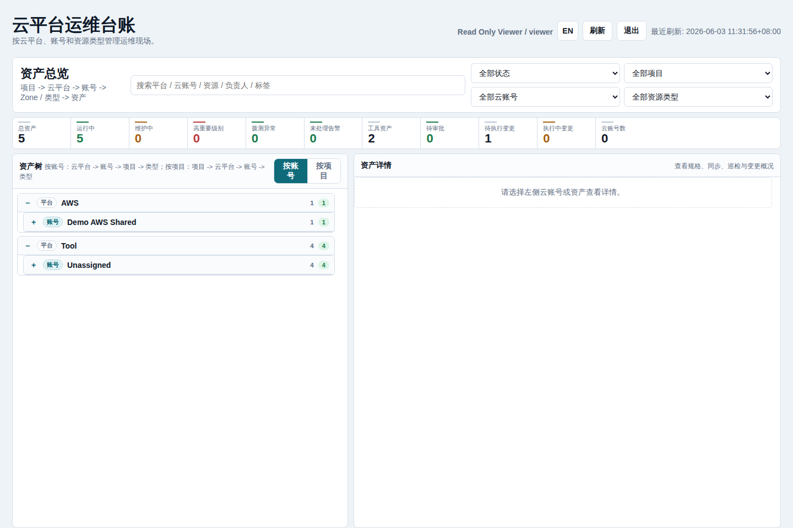
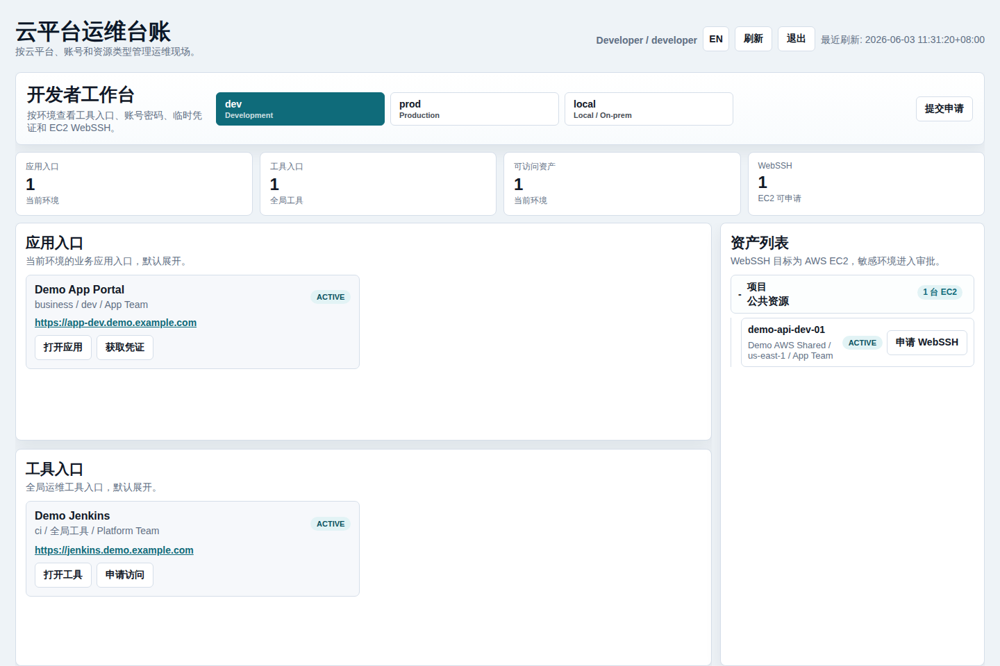
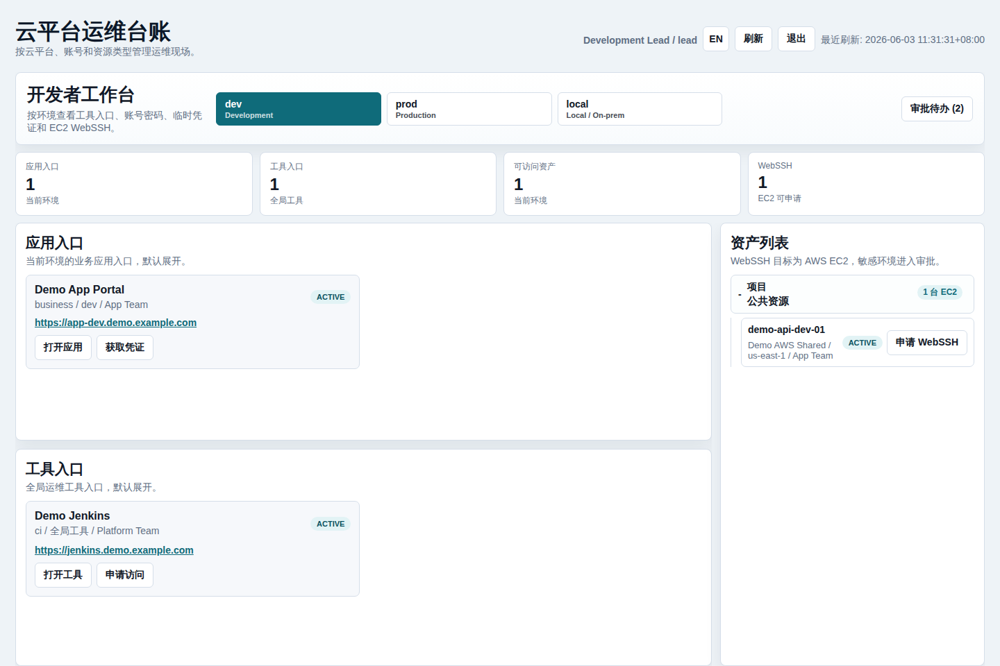
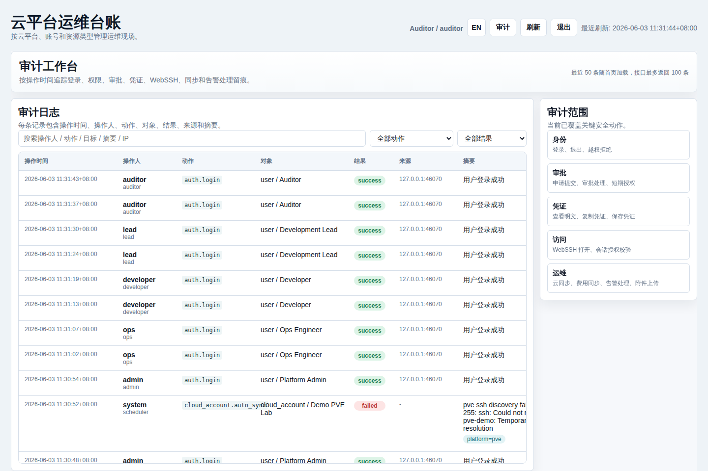

# OpsLedger

面向 SRE、DevOps、平台工程和小型云运维团队的自托管云平台运维台账、轻量 CMDB、云资产管理、凭证审批、审计日志、费用快照和 WebSSH 运维入口。

[English](./README.md)

OpsLedger 是一套轻量级云平台运维台账系统，适合小型平台团队和 SRE 团队使用。它把云账号、云资产、凭证、审批、审计、拨测、费用快照和受控 WebSSH 入口集中到一个 Go 单体服务里。

## 搜索关键词

中文搜索可以使用：**云平台运维台账**、**云资产管理**、**开源 CMDB**、**自托管 CMDB**、**运维资产台账**、**云账号管理**、**凭证审批**、**权限审批流**、**WebSSH 堡垒机**、**AWS 资产发现**、**Cloudflare DNS 管理**、**PVE 虚拟机台账**、**运维审计日志**、**云成本快照**、**开发者工作台**。

English keywords: **cloud operations ledger**, **cloud asset inventory**, **open source CMDB**, **self-hosted CMDB**, **DevOps asset management**, **SRE operations platform**, **cloud account management**, **credential approval workflow**, **WebSSH gateway**, **AWS asset discovery**, **Cloudflare DNS inventory**, **PVE VM inventory**, **infrastructure audit log**, **cloud cost snapshot**, and **internal developer portal**.

## 产品功能

- **运维资产台账**：统一管理云平台、云账号、项目、环境、资源类型、资产规格、负责人、状态、重要级别、标签、巡检、变更和同步留痕。
- **云资源自动发现**：支持 AWS 资产和 Cost Explorer 费用快照、Cloudflare Zone/DNS/边缘资源、PVE Host/VM 只读发现；平台模型已预留阿里云、腾讯云和手工资产。
- **开发者自助入口**：开发者按环境查看业务应用入口、全局工具、可访问资产、临时凭证和 EC2 WebSSH 申请动作。
- **审批与短期授权**：凭证和 WebSSH 申请走可配置审批流，审批通过后生成有过期时间的短期授权，避免长期共享账号。
- **凭证治理**：支持云账号密钥、工具密码、API Token、SSH Key 和通用 Secret 的加密存储、脱敏展示和受控查看。
- **审计留痕**：记录登录、权限拒绝、审批、凭证明文查看/复制、WebSSH、同步、告警和附件操作，包含时间、操作者、对象、结果、来源和摘要。
- **费用与分账基础**：保存 AWS 账号费用快照，并提供项目分账视图，为后续接入 Cost Allocation Tag 或 CUR 做准备。
- **部署形态**：单 Go 二进制内嵌前端页面，默认 SQLite，也可切 PostgreSQL/MySQL；提供 Docker Compose 和 systemd 部署方式。

## 角色工作台

| 角色 | 默认工作台 | 典型工作内容 |
| --- | --- | --- |
| 平台管理员 | 运维工作台 | 配置云平台、云账号、用户、角色、权限、审批流、标签、同步任务和安全参数。 |
| 运维工程师 | 运维工作台 | 维护资产、同步云账号、查看巡检和告警、处理审批、管理凭证。 |
| 开发者 | 开发者工作台 | 打开应用和工具入口、查看授权范围内资产、申请凭证、申请或使用已批准的 WebSSH。 |
| 开发负责人 | 开发者工作台 | 作为开发者使用系统，并审批开发/测试环境的团队申请。 |
| 审计员 | 审计工作台 | 按时间查看审计事件、权限拒绝、凭证访问、审批动作、WebSSH 会话、同步和告警处理。 |
| 只读观察员 | 只读运维工作台 | 查看资产状态、账号态势、费用、巡检和变更，不能进入配置和写操作。 |

## 功能矩阵

| 功能域 | 能力说明 |
| --- | --- |
| 资产模型 | 平台 -> 账号 -> 项目/环境/资源类型 -> 资产，资产包含标签、规格、状态、负责人和重要级别。 |
| 云账号 | 凭证托管、手动同步、定时同步、同步历史、账号详情卡片和费用快照。 |
| AWS | EC2、EBS、EIP、ELB、S3、RDS、VPC、Subnet、Security Group 自动发现，支持标签导入、陈旧资产标记和 Cost Explorer 费用快照。 |
| Cloudflare | Zone、DNS Record、Worker、R2、WAF Ruleset、Load Balancer 自动发现，支持域名到期时间和 DNS 拨测记录。 |
| PVE | 只读发现 Host、VM、LXC、Storage、Network、Snapshot、Backup Job、Cluster、Pool。 |
| 工具和应用 | 全局工具入口和按环境划分的业务应用入口，可关联凭证治理。 |
| 审批 | 凭证和 WebSSH 申请走可配置审批流，支持步骤审批角色，审批通过后生成短期授权。 |
| WebSSH | 浏览器内 SSH 会话，面向审批通过的 EC2 资产，依赖短期授权并写入审计。 |
| 巡检告警 | 自动拨测、巡检记录、告警记录、附件、处理状态和资产级历史。 |
| 安全 | HttpOnly Session、CSRF、RBAC、数据范围、凭证加密、审计留痕和可选严格 SSH 主机指纹校验。 |
| 部署 | 首次部署向导、默认 SQLite、PostgreSQL/MySQL 支持、Docker Compose 和 systemd 安装脚本。 |

## 截图

### 首次部署


### 运维工作台

管理员和运维角色使用云平台运维工作台，重点关注资产树、账号视图、巡检、变更、审批和同步状态。




只读观察员可以查看运行状态，但不能进入配置和变更操作。



### 开发者工作台

开发者和开发负责人使用环境优先的工作台，查看应用入口、全局工具、凭证申请和 WebSSH 申请。





### 审计工作台

审计员使用独立审计页面，按时间追踪安全和运维操作事件。



## 快速启动

使用本地 SQLite 数据库运行：

```bash
go run ./cmd/opsledger
```

打开：

```text
http://127.0.0.1:18090/
```

首次部署时，OpsLedger 会自动初始化数据库表。如果数据库中还没有用户，登录页会切换到初始化向导，引导你创建第一个平台管理员账号。系统不会生成默认弱口令。

## 容器部署

```bash
cp deploy/opsledger.env.example .env
docker compose up -d --build
```

服务默认监听：

```text
http://localhost:18090/
```

SQLite 数据保存在 `opsledger-data` Docker volume 中。

## 二进制部署

如果希望复制到 Linux 或 Windows 服务器后直接启动，不在目标机器安装 Go，可以先生成发布包：

```bash
./scripts/build-release.sh v0.1.0
ls -lh releases/
```

Linux 包：

```bash
tar -xzf releases/opsledger-v0.1.0-linux-amd64.tar.gz
cd opsledger-v0.1.0-linux-amd64
./start.sh
```

Windows 包：

```powershell
Expand-Archive .\releases\opsledger-v0.1.0-windows-amd64.zip
cd .\opsledger-v0.1.0-windows-amd64
.\start.ps1
```

如果是在已安装 Go 的 Linux 主机上以 systemd 托管服务运行：

```bash
sudo ./scripts/install-systemd.sh
sudo systemctl status opsledger --no-pager
```

安装脚本会构建 `./cmd/opsledger`，安装到 `/opt/opsledger`，创建 `/var/lib/opsledger`，在缺失时写入 `/etc/opsledger/opsledger.env`，并启用 `opsledger` systemd 服务。

## 重要环境变量

| 变量 | 默认值 | 说明 |
| --- | --- | --- |
| `OPSLEDGER_ADDR` | `127.0.0.1:18090` | HTTP 监听地址。容器中通常使用 `0.0.0.0:18090`。 |
| `OPSLEDGER_DATA` | `data/opsledger.db` | SQLite 数据库路径。 |
| `OPSLEDGER_DB_DRIVER` | `sqlite3` | 数据库驱动：`sqlite3`、`postgres` 或 `mysql`。 |
| `OPSLEDGER_DB_DSN` | 空 | PostgreSQL 或 MySQL DSN。 |
| `OPSLEDGER_CREDENTIAL_KEY` | 开发派生密钥 | 凭证加密密钥，生产环境必须设置稳定高强度值。 |
| `OPSLEDGER_COOKIE_SECURE` | `false` | HTTPS 后面运行时设为 `true`。 |
| `OPSLEDGER_DEV_SEED_USERS` | `false` | 仅显式启用时创建本地测试用户。 |
| `OPSLEDGER_DEV_SEED_PASSWORD` | 空 | 开发测试用户统一密码。 |
| `OPSLEDGER_SEED_EXAMPLE_TOOLS` | `false` | 可选创建示例工具入口。 |
| `OPSLEDGER_SSH_STRICT_HOST_KEY` | `false` | WebSSH 是否强制校验 SSH 主机指纹。 |
| `OPSLEDGER_SSH_KNOWN_HOSTS` | 空 | WebSSH 使用的 known_hosts 文件。 |
| `OPSLEDGER_PVE_SSH_STRICT_HOST_KEY` | `false` | PVE 自动发现是否强制校验 SSH 主机指纹。 |
| `OPSLEDGER_PVE_SSH_KNOWN_HOSTS` | 空 | PVE 自动发现使用的 known_hosts 文件。 |

## 目录结构

```text
cmd/opsledger/          服务启动入口
internal/app/           HTTP API、内嵌 UI、认证、审批、WebSSH
internal/discovery/     AWS、Cloudflare、PVE 资源发现
internal/model/         数据模型
internal/store/         存储、迁移、种子数据、RBAC、审计、凭证
deploy/                 systemd 和环境变量示例
scripts/                安装与运维脚本
docs/                   公开文档
data/.gitkeep           占位文件；运行时数据库文件会被忽略
```

## 安全注意

- 不要提交运行数据库、`.env`、备份、私钥或云凭证。
- 存储真实凭证前必须设置 `OPSLEDGER_CREDENTIAL_KEY`。
- 生产环境应放在 HTTPS 后面，并设置 `OPSLEDGER_COOKIE_SECURE=true`。
- 生产 WebSSH/PVE 自动发现应启用严格 SSH 主机指纹校验。
- 公开部署和生产环境必须关闭开发测试用户 seed。

更多说明见 [SECURITY.md](./SECURITY.md) 和 [docs/deployment.md](./docs/deployment.md)。

## 许可证

MIT
