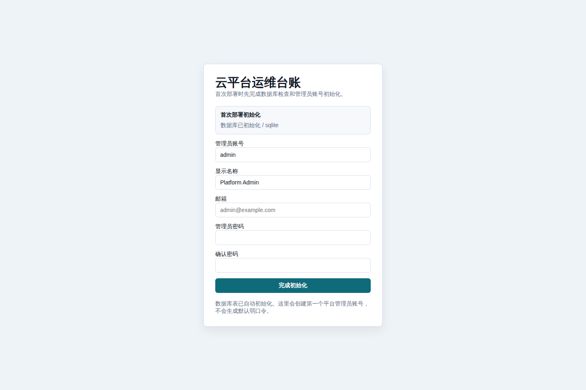

# OpsLedger

[English](./README.md)

OpsLedger 是一套轻量级云平台运维台账系统，适合小型平台团队和 SRE 团队使用。它把云账号、云资产、凭证、审批、审计、拨测、费用快照和受控 WebSSH 入口集中到一个 Go 单体服务里。

## 功能特性

- 单个 Go 二进制运行，前端页面内嵌在服务中。
- 默认使用 SQLite，同时支持 PostgreSQL 和 MySQL DSN。
- 支持 AWS、Cloudflare、PVE、阿里云、腾讯云和手工资产的账号与资产台账。
- AWS 自动发现常见资源类型，并同步 Cost Explorer 费用快照。
- Cloudflare 自动发现 Zone、DNS 记录、Workers、R2 Bucket、WAF Ruleset 和 Load Balancer。
- PVE 通过只读 SSH 命令自动发现节点、虚拟机和相关配置。
- 内置本地登录、角色工作台、审批流程、审计事件和凭证加密。
- 支持面向 EC2 资产的临时 WebSSH 授权流程。
- 提供容器化部署和 systemd 二进制部署示例。

## 截图



## 快速启动

使用本地 SQLite 数据库运行：

```bash
go run ./cmd/opsledger
```

打开：

```text
http://127.0.0.1:18090/
```

首次部署时，OpsLedger 会自动初始化数据库表。如果数据库中还没有用户，登录页会切换到初始化向导，引导你创建第一个平台管理员账号。系统不会生成默认弱口令。

## 容器部署

```bash
cp deploy/opsledger.env.example .env
docker compose up -d --build
```

服务默认监听：

```text
http://localhost:18090/
```

SQLite 数据保存在 `opsledger-data` Docker volume 中。

## 二进制部署

在已安装 Go 的 Linux 主机上执行：

```bash
sudo ./scripts/install-systemd.sh
sudo systemctl status opsledger --no-pager
```

安装脚本会构建 `./cmd/opsledger`，安装到 `/opt/opsledger`，创建 `/var/lib/opsledger`，在缺失时写入 `/etc/opsledger/opsledger.env`，并启用 `opsledger` systemd 服务。

## 重要环境变量

| 变量 | 默认值 | 说明 |
| --- | --- | --- |
| `OPSLEDGER_ADDR` | `127.0.0.1:18090` | HTTP 监听地址。容器中通常使用 `0.0.0.0:18090`。 |
| `OPSLEDGER_DATA` | `data/opsledger.db` | SQLite 数据库路径。 |
| `OPSLEDGER_DB_DRIVER` | `sqlite3` | 数据库驱动：`sqlite3`、`postgres` 或 `mysql`。 |
| `OPSLEDGER_DB_DSN` | 空 | PostgreSQL 或 MySQL DSN。 |
| `OPSLEDGER_CREDENTIAL_KEY` | 开发派生密钥 | 凭证加密密钥，生产环境必须设置稳定高强度值。 |
| `OPSLEDGER_COOKIE_SECURE` | `false` | HTTPS 后面运行时设为 `true`。 |
| `OPSLEDGER_DEV_SEED_USERS` | `false` | 仅显式启用时创建本地测试用户。 |
| `OPSLEDGER_DEV_SEED_PASSWORD` | 空 | 开发测试用户统一密码。 |
| `OPSLEDGER_SEED_EXAMPLE_TOOLS` | `false` | 可选创建示例工具入口。 |
| `OPSLEDGER_SSH_STRICT_HOST_KEY` | `false` | WebSSH 是否强制校验 SSH 主机指纹。 |
| `OPSLEDGER_SSH_KNOWN_HOSTS` | 空 | WebSSH 使用的 known_hosts 文件。 |
| `OPSLEDGER_PVE_SSH_STRICT_HOST_KEY` | `false` | PVE 自动发现是否强制校验 SSH 主机指纹。 |
| `OPSLEDGER_PVE_SSH_KNOWN_HOSTS` | 空 | PVE 自动发现使用的 known_hosts 文件。 |

## 目录结构

```text
cmd/opsledger/          服务启动入口
internal/app/           HTTP API、内嵌 UI、认证、审批、WebSSH
internal/discovery/     AWS、Cloudflare、PVE 资源发现
internal/model/         数据模型
internal/store/         存储、迁移、种子数据、RBAC、审计、凭证
deploy/                 systemd 和环境变量示例
scripts/                安装与运维脚本
docs/                   公开文档
data/.gitkeep           占位文件；运行时数据库文件会被忽略
```

## 安全注意

- 不要提交运行数据库、`.env`、备份、私钥或云凭证。
- 存储真实凭证前必须设置 `OPSLEDGER_CREDENTIAL_KEY`。
- 生产环境应放在 HTTPS 后面，并设置 `OPSLEDGER_COOKIE_SECURE=true`。
- 生产 WebSSH/PVE 自动发现应启用严格 SSH 主机指纹校验。
- 公开部署和生产环境必须关闭开发测试用户 seed。

更多说明见 [SECURITY.md](./SECURITY.md) 和 [docs/deployment.md](./docs/deployment.md)。

## 许可证

MIT
